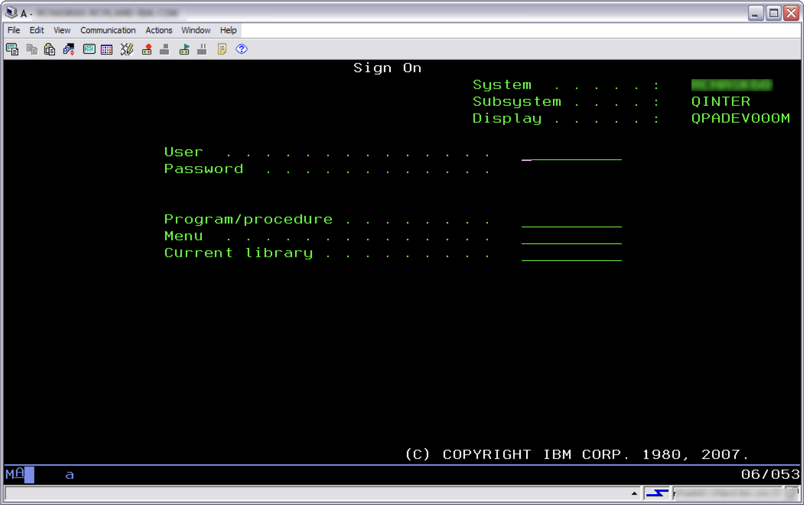

---
copyright:
  years: 2024, 2024
lastupdated: "2024-10-20"

subcollection: ibmi-managed-powervs
---

{{site.data.keyword.attribute-definition-list}}

# Connecting to IBM i
{: #connect}

Connection information will be provided to you as part on the onboarding process. The service offering provides private connectivity with your on-prem network via IBM Cloud Direct Link connections. This means you may continue to use your IBM i Client Access application to establish a 5250 Terminal Session:

