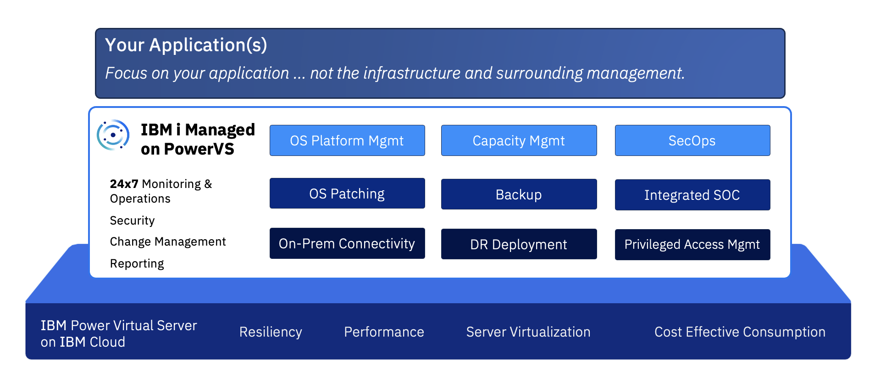

---
copyright:
  years: 2024, 2025
lastupdated: "2025-01-28"

subcollection: ibmi-managed-powervs
---

{{site.data.keyword.attribute-definition-list}}

# Overview
{: #overview}

IBM i Managed on Power Virtual Server (PowerVS) is a cloud offering where IBM hosts and manages IBM i LPARs (Virtual Servers) on IBM Cloud. This offering extends the existing IaaS based PowerVS on IBM Cloud offering, to one where IBM Cloud will monitor and manage IBM i LPARs and associated infrastructure (network, memory, storage), apply fixes and updates to the IBM i operating system, and manage the applicable security and private controls.

## Offering Components
{: #offering}

The offering consists of the following service components:

### Managed Base Services
{: #offering-base}

Managed Base Services provides hosting and managing for all common components that will be used by all PowerVS Virtual Servers deployed for client use.  Managed Base Services has a separate monthly charge and is applied regardless of how many PowerVS Virtual Servers are ordered. 

Onboarding is a part of this service component and includes an assessment and validation of requirements to ensure alignment with client requirements. The onboarding considers the number of PowerVS Virtual Servers and networking requirements to ensure successful use of the service.

### IBM i Managed
{: #offering-ibmi}

This service component represents one PowerVS virtual server with IBM i operating system (OS) and the associated networking for connectivity. This also includes monitoring and operations, operating system patch management, backup and restore, and privileged access management for the virtual server. 

### Optional Services
{: #offering-optional}

Optional add-on services include:

* Disaster Recovery Environment
* Multi-Factor Authentication
* Network/Connectivity for on-prem via private Direct Link(s)
* FalconStor Backup
