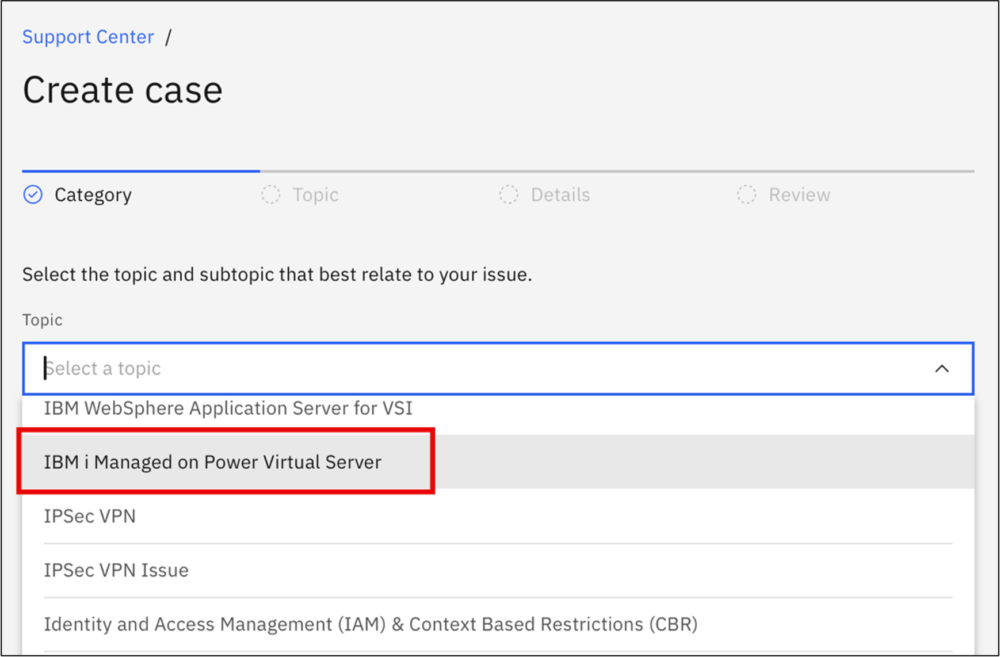

---
copyright:
  years: 2024, 2025
lastupdated: "2025-01-28"

subcollection: ibmi-managed-powervs
---

{{site.data.keyword.attribute-definition-list}}

# Getting Support
{: #getting-support}

If you experience an issue or have questions when using this service, the following resources are available: 

- Review the [FAQs](/docs/ibmi-managed-powervs?topic=ibmi-managed-powervs-faqs) in the documentation.

- Review the [IBM i Troubleshooting documentation](https://www.ibm.com/docs/en/i/7.5?topic=troubleshooting)

You also have the option of opening a support case for further assistance. For detailed steps on how to do so, please refer to: [Creating support cases](/docs/get-support?topic=get-support-open-case). 

** NOTE: When creating a support case, select the "IBM i Managed on PowerVS" topic: **

{: caption="Opening a support case" caption-side="bottom"}
